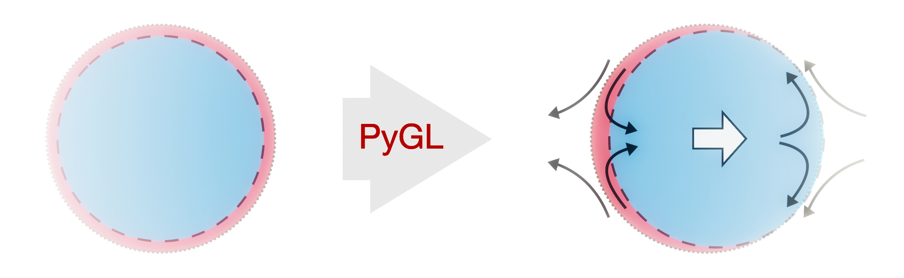

PyGL API
==================================

`PyGL <https://github.com/rajeshrinet/pygl>`_ is a 
is a numerical library for simulations of field theories in Python. The name GL corresponds to the Ginzburg–Landau theory. The library constructs differentiation matrices using finite-difference and spectral methods. It also allows to solve Stokes equation using a spectral method, which satisfies compressibility exactly. The library currently offers support for doing field theoretical simulation and a direct numerical simulation of the Stokes equation (implementation for non-zero Reynolds number is planned) in both two and three space dimensions.

Please see installation instructions and more details in the `README.md <https://github.com/rajeshrinet/pygl/blob/master/README.md>`_ on GitHub. 

API Reference
=============

.. toctree::
   :maxdepth: 1

   
   dms
   solvers
   utils
